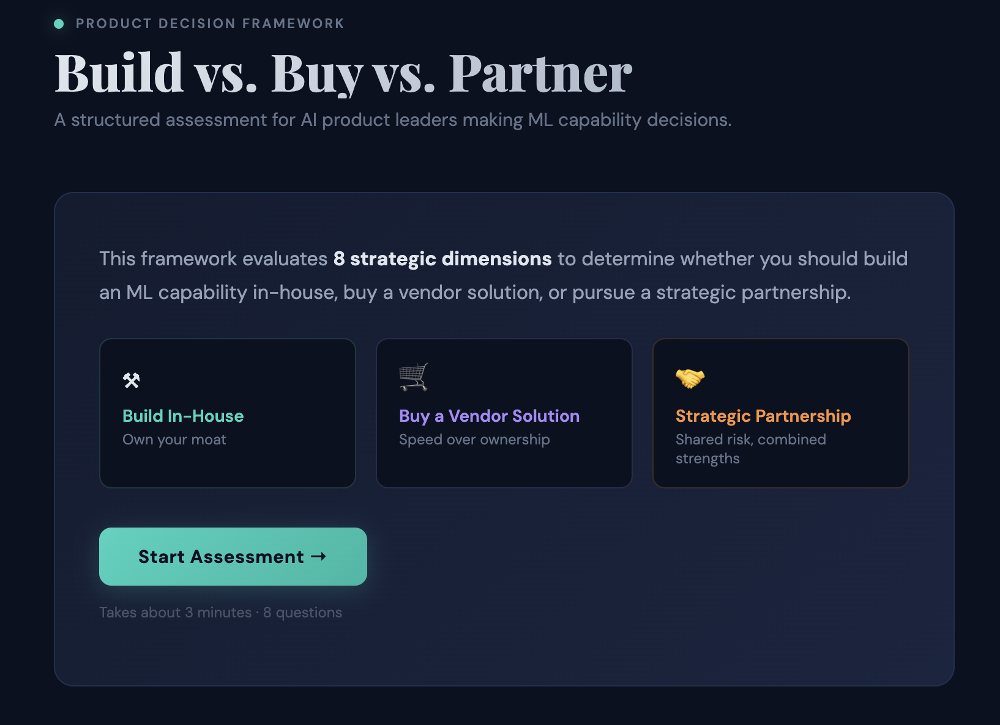

# Build vs. Buy vs. Partner: Decision Framework for AI Product Leaders

A structured, interactive assessment tool that helps product and engineering leaders evaluate whether to **build an ML capability in-house**, **buy a vendor solution**, or **pursue a strategic partnership**.

🔗 **[Try the live demo →](https://build-buy-partner-framework.vercel.app/)**



---

## Why This Exists

Every AI product leader faces the same recurring question: *should we build this ourselves?*

The answer is never straightforward. It depends on a web of interconnected factors — your team's capabilities, your data assets, competitive dynamics, budget constraints, and how central the capability is to your product's differentiation. Most teams make this decision based on gut instinct or whoever argues loudest in the room.

This tool replaces that with a structured, repeatable framework. It evaluates **8 strategic dimensions** with weighted scoring to produce a data-informed recommendation — along with the nuance of *why* and *what to do next*.

## How It Works

The assessment walks through 8 dimensions that matter most for ML capability decisions:

| Dimension | What It Evaluates |
|---|---|
| **Strategic Alignment** | How core is this capability to your product differentiation? |
| **Team Capability** | Do you have the ML talent to build and maintain this? |
| **Time-to-Market** | How urgently do you need this in production? |
| **Data Readiness** | Do you have proprietary data that creates a moat? |
| **Product Requirements** | How much customization does your use case demand? |
| **Market Maturity** | Are there credible vendors, or is this greenfield? |
| **Financial Context** | What's your budget reality? |
| **Risk & Control** | How important is owning the roadmap? |

Each answer is scored against all three strategies (Build, Buy, Partner) using independent weight vectors. This means selecting "we have strong ML talent" doesn't just boost Build — it also *reduces* the Buy signal and *moderately* supports Partner, reflecting how these decisions actually work in practice.

## The Scoring Model

Rather than simple additive scoring, each question uses **strategy-specific weight vectors**. For example:

- "Highly custom use case" → Build: 5, Buy: 0, Partner: 2
- "Mature vendor landscape" → Build: 0, Buy: 5, Partner: 2

This captures the reality that these dimensions don't contribute equally across strategies. The final recommendation includes a **confidence gap** metric showing how decisive the result is — a 40% gap means the recommendation is strong, while a 5% gap suggests a hybrid approach may be warranted.

## Results Include

- **Composite scores** with animated visualizations for all three options
- **Radar chart** showing which dimensions drove the recommendation
- **Pros and cons** specific to the winning strategy
- **Concrete next steps** — not generic advice, but actionable moves
- **Dimension-by-dimension breakdown** showing how each answer influenced the scores

## Product Thinking Behind the Design

A few deliberate decisions worth noting:

**Progressive disclosure over upfront complexity.** Users see one question at a time rather than a wall of inputs. This reduces cognitive load and improves completion rates — the same principle that makes typeform-style surveys outperform traditional forms.

**Weighted vectors over simple tallying.** A naive approach would add +1 to "Build" for every pro-build answer. But real decisions have asymmetric signal — having proprietary data is a *much stronger* signal for Build than having budget is for Buy. The weight vectors capture this.

**Actionable output over abstract scores.** The results page doesn't just say "Build." It tells you what to do Monday morning, what risks to watch for, and when to reconsider.

**Confidence gap as a meta-signal.** When Build scores 35 and Partner scores 33, the right answer isn't "Build" — it's "these are close, consider a hybrid." The confidence gap makes this visible.

## Built With

- React + Vite
- No external UI libraries — custom components throughout
- Responsive design for desktop and mobile

## Local Development

```bash
git clone https://github.com/jananmg/build-buy-partner-framework.git
cd build-buy-partner-framework
npm install
npm run dev
```

## About Me

I'm a product leader focused on AI/ML products in the geospatial and infrastructure space. This tool was born from repeatedly navigating build-vs-buy decisions for ML capabilities and wanting a more structured way to think through them.

**https://www.linkedin.com/in/jananguillaume/** · **[Email](mailto:jananmc@gmail.com)**

---

*If you find this useful, give it a ⭐ — it helps others discover it.*
